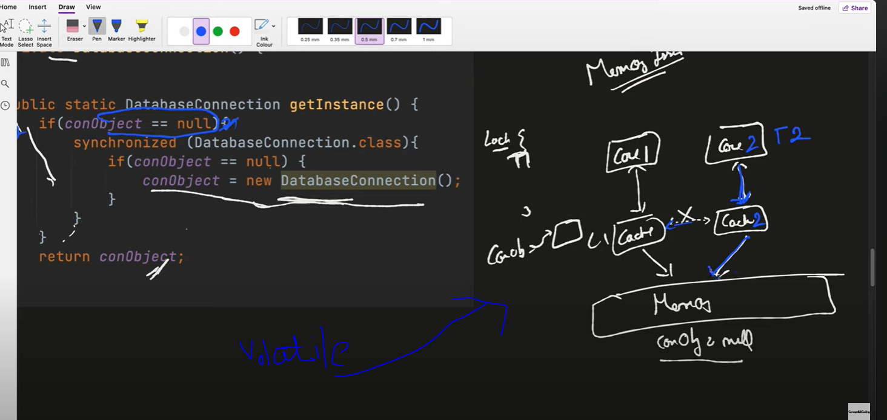

In double checking locking why volatile keyword is being used.
cause during computation for faster compu all threads store computed data in L1 cache and directly does not update in memory
It is quite possible that first thread created a new instance but it didn't write in memory and cache sync does not happend yet
so thread2 also saw instance is null so he created new instance again 

So avoid that we have used volatile keyword so that thread write in memory so that other threads can see.

To overcome the memory issue we have used it 